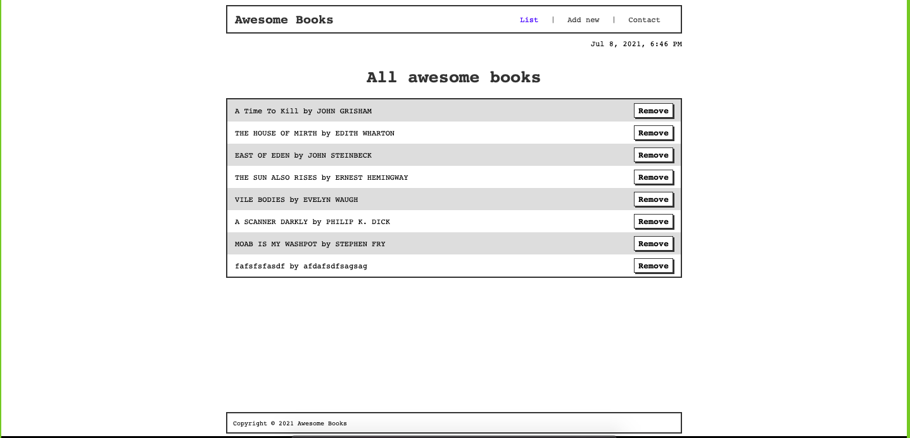
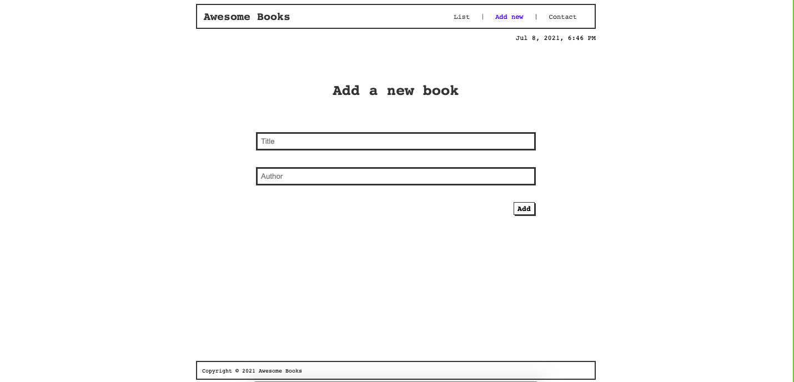
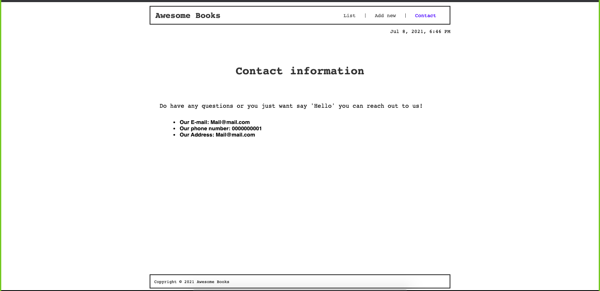

# Awesome Books

Website that allows users to add/remove books from a list.

# Built With

- HTML
- CSS
- JavaScript

# Live Demo

- [Awesome Books](https://alonsofl.github.io/awesome-books/)

# Getting Started

  - Use your github account and your terminal to clone this repository to your computer.
  - git clone https://github.com/alonsofl/awesome-books.git
  - Go to the cloned directory: cd awesome-books/

# Authors

## 👤 Author1

- GitHub: [Alonso Falconi](https://github.com/alonsofl)
- Twitter:[@alonsofalconi](https://www.twitter.com/alonsofalconi)
- LinkedIn: [Alonso Falconi](https://www.linkedin.com/in/alonsofalconi)

## 👤 Author2

- GitHub: [Amal Hersi](https://github.com/Amalcxc)
- Twitter: [@Amalcx4](https://twitter.com/home?lang=en)
- LinkedIn: [Amal Hersi](https://www.linkedin.com/in/amal-hersi-a29583205/)

# 🤝 Contributing

- Contributions, issues, and feature requests are welcome!
- Feel free to check the issues page.

# Show your support

- Give a ⭐️ if you like this project!

# 📝 License

- This project is MIT licensed.